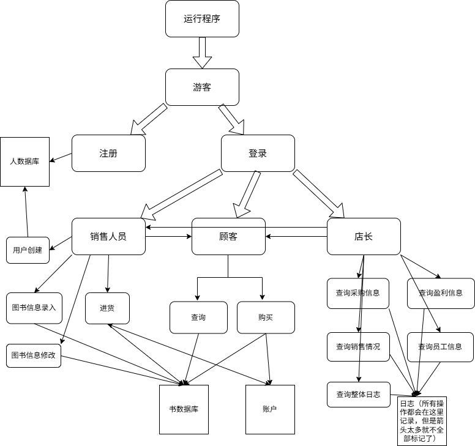

# 书店管理系统需求分析

## 一、项目概览

### 项目名称

书店管理系统

### 项目背景与目标

~~大作业任务~~
开发一个系统，使得管理书店变得更加方便高效

### 读者与范围

~~助教~~
设计
开发
测试
项目经理

## 二、用户角色与特征

### 用户角色

- **游客**
- **顾客**
- **销售人员**
- **店长**

### 用户画像

#### 游客

游客只能注册/登录用户。

#### 顾客

顾客可以查询和购买图书。

- 每种图书包含的信息有：ISBN 号（20 个字符，每本正版书都有惟一的标识）、书名（60 个字符、作者（60 个字符）、关键字（可以有多个，总共不超过 60 个字符）、库存量（整型）、单价（非负实数）；

- 查询图书时可以根据 ISBN 号、作者名字、关键字、书名中的任意组合进行查询；
- 购买图书时，我们通过给定的 ISBN 号和购买数量来进行操作；

#### 销售人员

销售人员可以执行所有顾客执行的操作，同时也可以进行进货、图书信息录入、图书信息修改、用户创建。

- 进货时需指定 ISBN 号、数量、进货价格;
- 第一次录入图书时，应当输入其完整信息；

#### 店长

店长可以执行所有销售人员和顾客可以执行的功能，同时也可以查询某段时间的采购信息（即按照采购顺序输出采购图书的 ISBN 号、数量、单价等）、销售情况（即按照销售顺序输出售出图书的 ISBN 号、数量、单价等）、盈利信息（即输出该段时间的收入，支出以及利润）。除此之外，店长也可以查看各员工的工作情况报告（即按操作顺序输出每次操作类型及其对象，如创建用户操作以及对应的用户信息）和系统的整体工作日志。

## 功能需求描述

注：
- 每个操作都会有一个相应的时间自动记录，并存放到日志系统，方便店长查询。
- 每个操作先读入指令，再判断权限。如果存在指令但没权限，输出"Permission denied"。如果是不存在的指令，输出"Invalid operation"。抛出异常。
- 每个操作过程中，如果输入"q"，则退出当前执行的程序，但保持相关的登录状态。

### 游客

#### 注册/登录
- 描述：用户选择登录/注册操作，并根据用户输入内容判断是否完成注册。
- 触发条件：用户输入"login"/"sign up"
- 处理流程：
    - 登录：输入账号，密码，判断是否符合规范，若正确则进入系统，否则重新输入
    - 注册：输入账号，若已有，则不允许注册；若没有，则输入密码完成注册
    - 若登录/注册成功，在shell里面返回“登录/注册成功”。
- 异常处理：出现问题，返回相应错误，返回登录/注册界面

### 顾客

#### 查询
- 描述：支持通过命令行查询图书，可以根据 ISBN 号、作者名字、关键字、书名中的任意组合进行查询。
- 触发条件：成功登录，并输入"find"。
- 处理流程：
    - 依次要求用户输入ISBN 号、作者名字、关键字、书名。若不输入则直接回车表示跳过。
    - 根据用户输入数据查询。若成功，则返回相应的书的信息。
- 异常处理：输入的信息不存在，则对于第一条出现错误的信息报错。

#### 购买
- 我们通过给定的 ISBN 号和购买数量来进行购买，完成支付后，对于数据库中的动账进行记录。
- 触发条件：成功登录，并输入"purchase"。
- 处理流程：
    - 要求用户输入ISBN号，查找是否存在。
    - 若存在，要求输入购买数量，否则比对书库中数量是否满足用户需求。
    - 若满足，则进行交易。
- 异常处理：
    - 书不存在，输出"Book not found"。
    - 书的数量不足，输出"Insufficient stock"，并返回当前还有几本。

### 销售人员

前两个操作保持相同

#### 进货
- 描述：进货，指定 ISBN 号、数量、进货价格，通过修改书的数据库和账户，来达成这一目的。
- 触发条件：登录为销售人员/店长，并输入"stock"。
- 处理流程：
    - 要求输入ISBN，查看是否符合规定。
    - 要求输入数量。
    - 要求输入进货价格。在账户上扣除相应的钱，在书库中进行维护。完成进货
- 异常处理：不符合ISBN号的输入，输出"Invalid ISBN number"。

#### 图书信息录入
- 描述：按照顺序依次输入：ISBN 号（20 个字符，每本正版书都有惟一的标识）、书名（60 个字符）、作者（60 个字符）、关键字（可以有多个，总共不超过 60 个字符）、库存量（整型）、单价（非负实数）。
- 触发条件：登录为销售人员/店长，并输入"Enter information"。
- 处理流程：
    - 要求依次输入ISBN 号（20 个字符，每本正版书都有惟一的标识）、书名（60 个字符、作者（60 个字符）、关键字（可以有多个，总共不超过 60 个字符）、库存量（整型）、单价（非负实数）。
- 异常处理：出现不符合要求数据，输出对应错误，并要求重新输入。

#### 图书信息修改
- 描述：对于特定的书目，修改对应的条目。
- 触发条件：登录为销售人员/店长，并输入"edit"。
- 处理流程：
    - 输入ISBN号确定修改的书目。
    - 输入修改的条目：书名、作者、关键字、库存量、单价。
    - 按照顺序依次完成修改。
- 异常处理：出现不符合要求数据，输出对应错误，并要求重新输入。
- 补充：如果要修改ISBN，需要重新添加。

#### 用户创建。
- 描述：创建一个销售人员的账户。
- 触发条件：登录为销售人员/店长，并输入"create account"。
- 处理流程：同注册，只不过需要创建的是一个销售人员而非顾客。
- 异常处理：同注册。

### 店长

前面的操作保持相同

#### 查询采购信息

- 描述：按时间顺序依次输出采购图书的 ISBN 号、数量、单价等。
- 触发条件：登录为销售人员/店长，并输入"find purchase information"。
- 处理流程：
    - 输入时间段。
    - 按顺序输出图书的 ISBN 号、数量、单价。
- 异常处理：
    - 时间段不存在，抛出"invalid time range"。
    - 无日志，则输出"No operation found"。

#### 查询销售情况

- 描述：按时间顺序输出售出图书的 ISBN 号、数量、单价等。
- 触发条件：登录为销售人员/店长，并输入"find sale information"。
- 处理流程：
    - 输入时间段。
    - 按顺序输出图书的 ISBN 号、数量、单价。
- 异常处理：
    - 时间段不存在，抛出"invalid time range"。
    - 无日志，则抛出"No operation found"。

#### 查询盈利信息

- 描述：按时间顺序输出每一笔收入，支出，并输出总收入、总支出、总利润。
- 触发条件：登录为销售人员/店长，并输入"find profit information"。
- 处理流程：
    - 输入时间段。
    - 按顺序输出每一笔收入，支出。
    - 输出总收入、总支出、总利润。
- 异常处理：
    - 时间段不存在，抛出"invalid time range"。
    - 无日志，则抛出"No operation found"。

#### 查询员工工作情况
- 描述：店长也可以查看各员工的工作情况报告（即按操作顺序输出每次操作类型及其对象，如创建用户操作以及对应的用户信息）
- 触发条件：登录为销售人员/店长，并输入"check shop assistants"。
- 处理流程：
    - 输入员工账户。
    - 按顺序输出该员工的操作。
- 异常处理：
    - 员工账户不存在，抛出"Invalid username"。

#### 查询整体日志
- 描述：输出所有相关的操作，按照时间顺序依次输出。
- 触发条件：登录为销售人员/店长，并输入"log"。
- 处理流程：
    - 按顺序输出每一个操作。
- 异常处理：
    - 无日志，则抛出"No operation found"。

## 非功能需求

### 性能需求

考虑到应用场景下帐户和图书数量较大，故**禁止将主体数据存储于内存**，应实时读写文件数据。运行过程中程序创建的文件数量不得超过 20 个。

应用块状链表保证查询和遍历的时间。

### 可靠性

建议密码足够复杂，保证不会随意登录

## 流程图
